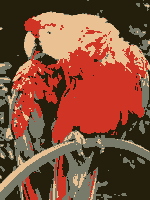

# Hand In - Lab 02

## Original Image Used in Task


## Output Image After KMeans Clustering



## Code Used in L02

```python
img_url = "https://upload.wikimedia.org/wikipedia/commons/d/d7/RGB_24bits_palette_sample_image.jpg"
img = download_img(img_url)
img_arr = img2arr(img)

# RGB pixel intensity of cluster. Img has MXN pixels -> reshaping image array to shape (M*N,3)
img_2d = img_arr.reshape((img_arr.shape[1]*img_arr.shape[0],3))

# Get the best numbers of clusters using the silhouette score
best_silhouette = 4  # this is to keep it fast (remove to evaluate again)
if not best_silhouette:
  all = []
  for x in range(3, 20):
    kmeans = KMeans(n_clusters=x, random_state=0).fit(img_2d)
    y_kmeans = kmeans.predict(img_2d)
    all.append((x,silhouette_score(img_2d, y_kmeans)))
  print(f"Best silhouette score with n clusters: {max(all, key=lambda x: x[1])[0]}")

kmeans_model = KMeans(n_clusters=4, random_state=0).fit(img_2d)
centroid=kmeans_model.cluster_centers_
rg_chroma_plot(img_2d, centroid)
# replace original colors by their nearest neighbors out of the candidate centers
replaced = replace_nearest_color(img_arr, centroid)
# convert to PIL.Image and visualize
display(arr2img(replaced))
```

## Short description

I've reshaped the image basically to the RGB intensity to fit the dimension
necessary for KMeans.

By looping over a range of 3-20 and calculating the silhouette score for
each number of clusters I found the best parameter (4 clusters). The parameter
is now set as a variable so it would run through faster for repeated runs...

After calculating the models with the `fit` operation I was able to extract
the centers of each cluster.

After that I repeated the steps shown by the previous exercises replacing the
colors with the ones of the four clusters for the original image.
